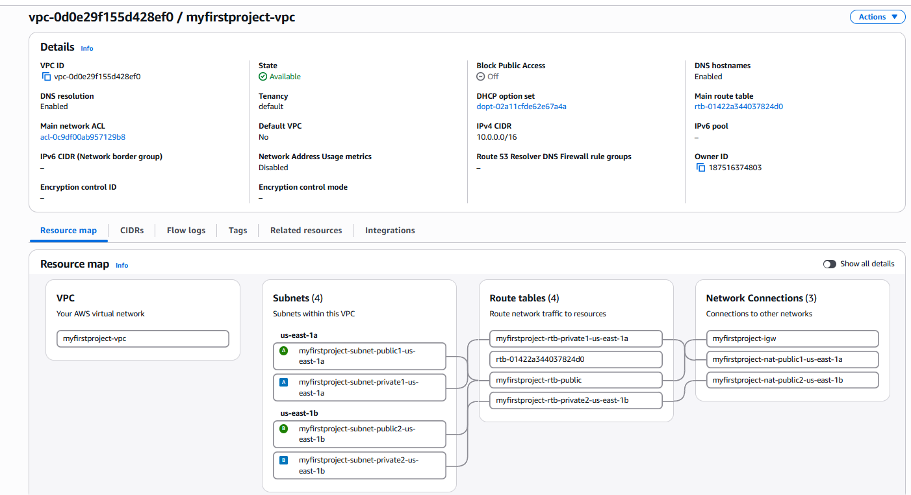
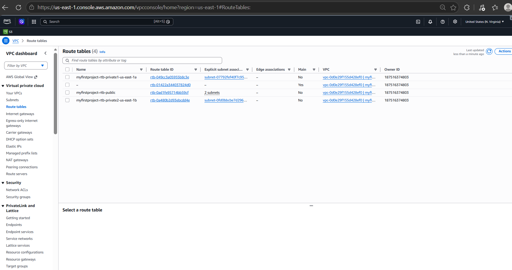
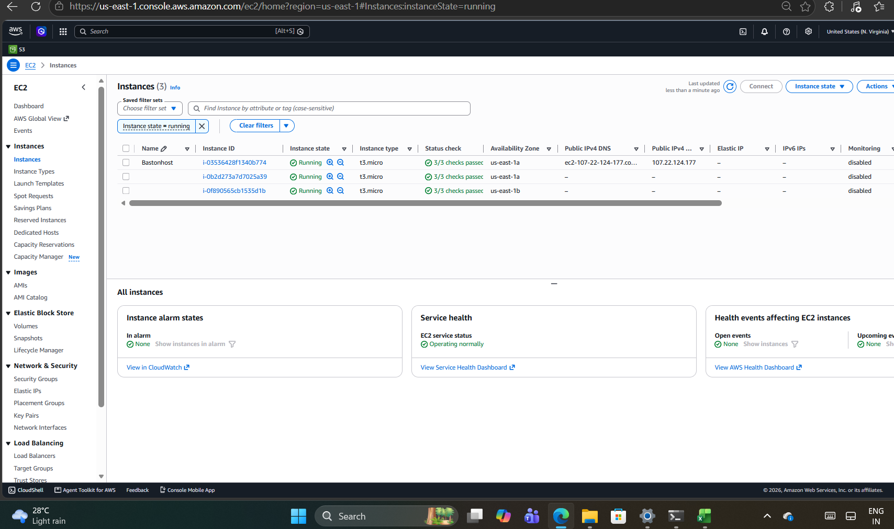
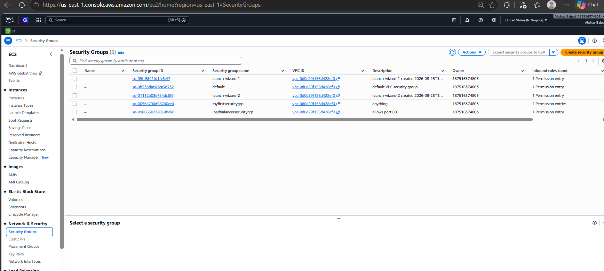
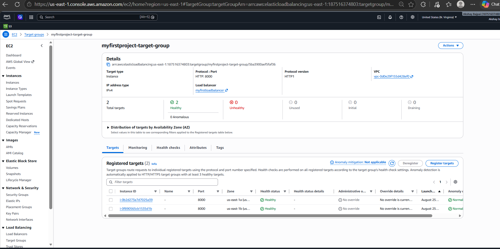
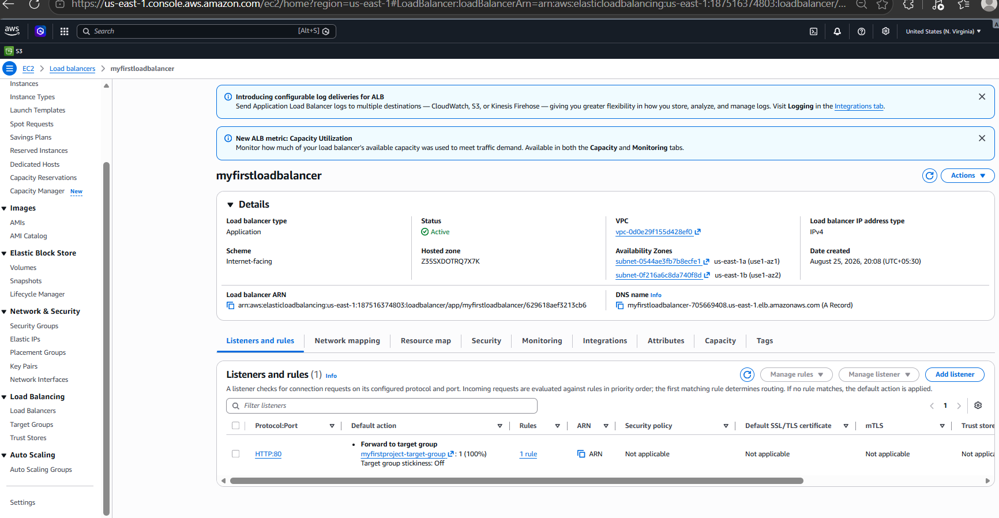
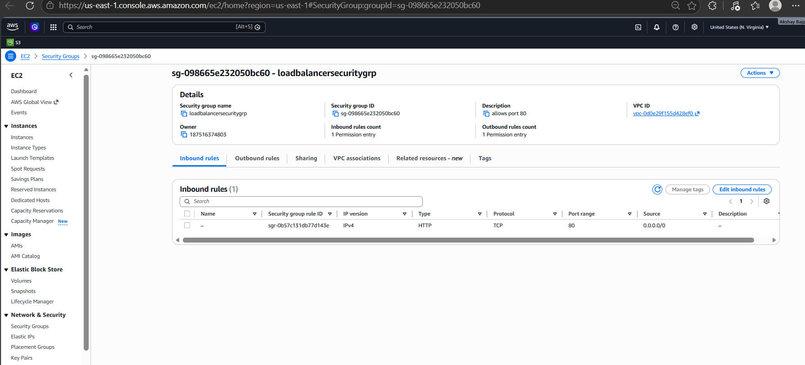
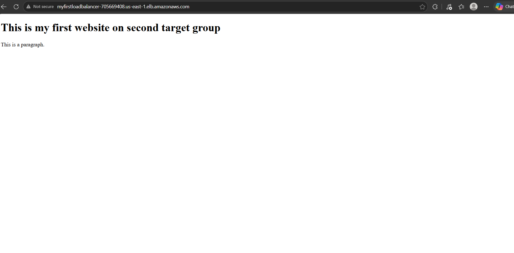

**AWS Production-Style VPC & Load Balancer Project**

## Overview

Designed and implemented a production-style AWS network architecture
using public and private subnets across two Availability Zones.

The project demonstrates secure private EC2 application deployment,
Bastion Host access, NAT-based outbound connectivity, and
Application Load Balancer-based traffic distribution.

## Architecture

## AWS Services Used

- Amazon VPC
- Amazon EC2
- Application Load Balancer
- Target Groups
- NAT Gateway
- Internet Gateway
- Route Tables
- Security Groups
- Bastion Host
- Linux

## Infrastructure

- 1 VPC
- Public and private subnets across 2 Availability Zones
- 2 NAT Gateways
- Bastion Host in a public subnet
- 2 application EC2 instances in private subnets
- Application Load Balancer in public subnets
- Target Group configured with HTTP port 8000

## Architecture Flow

Internet
↓
Application Load Balancer:80
↓
Target Group:8000
↓
Private EC2 Instances:8000
↓
Python HTTP Application

## Network Architecture

The VPC was designed with separate public and private subnets
across two Availability Zones.

Public subnets contain the Bastion Host and NAT Gateways.

Private subnets contain the application EC2 instances.

Private instances use NAT Gateways for outbound internet connectivity.

## Security

- Bastion SSH access restricted to the administrator's IP
- Private EC2 instances do not require public IP addresses
- SSH access to private EC2 instances is controlled through the Bastion Host
- Application traffic on port 8000 is allowed from the ALB Security Group
- ALB accepts HTTP traffic on port 80

## Application Deployment

A simple HTML application was deployed on the private EC2 instances.

The application was served using a Python HTTP Server:

    python3 -m http.server 8000

The application was accessed externally through the Application
Load Balancer rather than directly exposing the private EC2 instances.

## Load Balancer

The Application Load Balancer listens on:

    HTTP:80

The ALB forwards requests to the Target Group on:

    HTTP:8000

The Target Group performs health checks against the private EC2 instances.

## Validation

The implementation was validated by:

- Verifying VPC and subnet configuration
- Verifying public and private route tables
- Verifying Internet Gateway and NAT Gateway configuration
- Accessing private EC2 instances through the Bastion Host
- Verifying Security Group traffic rules
- Verifying Target Group health checks
- Verifying ALB listener configuration
- Accessing the application through the ALB DNS

## Project Evidence

### VPC Resource Map

### Route Tables

### EC2 Bastion Host

### Security Groups

### Target Group Health

### Load Balancer

### Load Balancer Security Group

### Application Through ALB (1)

### Application Through ALB (2)

## Key Learnings

- AWS VPC networking
- Public vs private subnet architecture
- Route table configuration
- NAT Gateway
- Internet Gateway
- Bastion Host connectivity
- Security Group-based traffic control
- Application Load Balancing
- Target Group health checks
- Private EC2 application deployment
- Linux server administration

## Cleanup

The AWS infrastructure was deleted after validation and documentation
to avoid unnecessary ongoing cloud costs.
